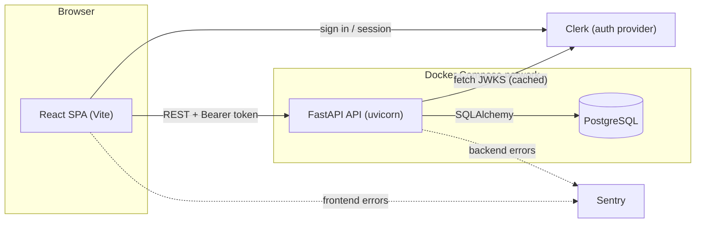
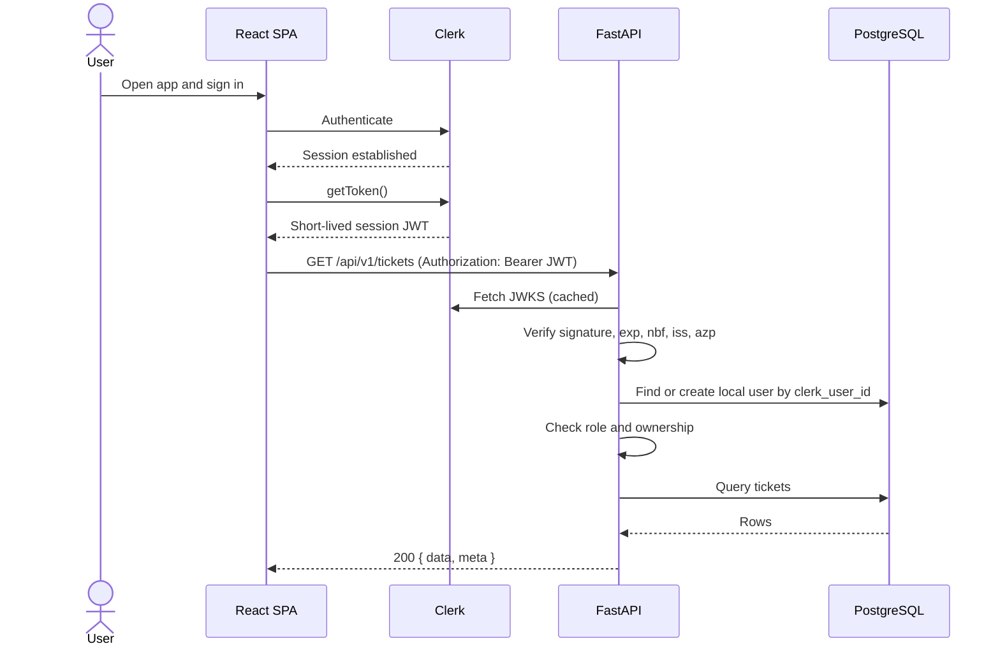
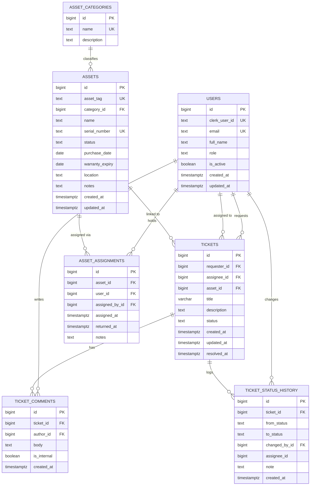
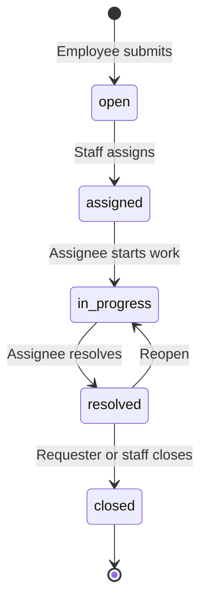
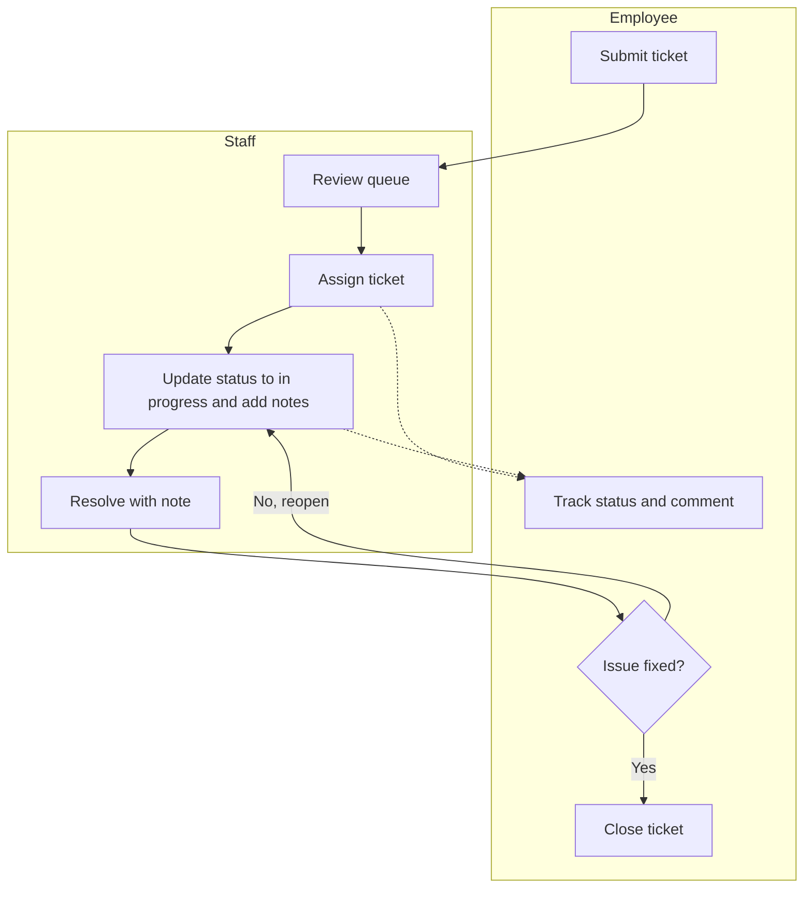

# Architecture.md: DeskTrack System Architecture

**Project:** DeskTrack (working name): IT Help Desk and Asset Tracker
**Timeline:** October-November 2026, solo developer, part-time
**Purpose of this file:** The approved system architecture. The AI assistant must follow it when designing or building anything in this project. If a request or a piece of code conflicts with this file, stop and ask before proceeding. Working rules live in `Rules.md`.

---

## 1. Overview

DeskTrack is a web app where employees submit IT support tickets, IT staff triage and resolve them, and admins manage IT equipment records. Assets are linked to users and tickets.

| Role | Can do |
|---|---|
| **employee** | Submit tickets, view their own tickets and status history, comment on their own tickets, close or reopen their own resolved tickets |
| **staff** | Everything an employee can, plus view all tickets, assign and reassign, change status, resolve, post internal notes, link an asset to a ticket, assign and return assets, view assets |
| **admin** | Everything staff can, plus create, edit, and retire assets and categories, change user roles, view report dashboards |

**Out of scope:** email notifications, file attachments, real-time updates, multi-tenancy, a mobile app, ticket categories and tags, and SLA features before Week 8.

## 2. Fixed decisions

| Layer | Decision |
|---|---|
| Frontend | React (JavaScript, not TypeScript) built with Vite |
| Backend | FastAPI (Python 3.12), synchronous endpoints and synchronous SQLAlchemy |
| Data layer | SQLAlchemy 2.x ORM, Alembic migrations, Pydantic v2 schemas |
| Database | PostgreSQL 16 |
| Authentication | Clerk (sign-in in React; the API verifies Clerk session tokens) |
| Local infrastructure | Docker Compose |
| Version control | GitHub, monorepo |
| Backend style | Modular monolith: Ticket, Asset, User, Report |
| Roles | `employee`, `staff`, `admin` (stored in the local database) |
| Monitoring and testing | Sentry, BrowserStack, pytest |
| Deployment | Azure (provisional; final choice between Azure and Heroku is confirmed in Week 7) |

## 3. System context



### Authenticated request flow



## 4. Technology stack and rationale

| Layer | Technology | Why it fits | Trade-off or risk |
|---|---|---|---|
| UI | React + Vite | Interactive ticket pages, fast dev server, large ecosystem | JavaScript has no compile-time type safety; rely on ESLint and tests |
| Routing and data | React Router, TanStack Query | Declarative routes; caching, loading, and error states for server data | Two libraries to learn; far less code than hand-rolled fetch state |
| Styling | Tailwind CSS | Fast mobile-first layouts without custom CSS sprawl | Utility-heavy markup; needs consistent component extraction |
| API | FastAPI | Automatic validation and OpenAPI docs, clean dependency injection for auth, builds on existing Python skills | Must keep sync and async consistent (decision: sync everywhere) |
| ORM and migrations | SQLAlchemy 2.x + Alembic | Mature, explicit, works well with PostgreSQL features (partial indexes, CHECK) | Autogenerated migrations must be reviewed by hand |
| Validation | Pydantic v2 | Typed request and response schemas, built into FastAPI | Separate create, update, and response schemas add files |
| Database | PostgreSQL 16 | Relational links between tickets, users, and equipment; constraints; aggregation for reports | Needs a managed instance in production |
| Auth | Clerk | Hosted sign-in, no local password storage | External dependency; session tokens are short-lived and carry minimal claims by default |
| Local infra | Docker Compose | One command to run the full stack | Compose files are not deployed directly by Heroku or Azure App Service |
| Source control | GitHub + Actions | CI, Dependabot, portfolio visibility | None significant |
| Monitoring | Sentry | Error tracking in both apps | Must scrub tokens and personal data |
| Cross-browser testing | BrowserStack | Real browsers and devices for the main workflows | Manual and time-limited; used for the three core workflows only |

### Backend dependencies
Runtime: `fastapi`, `uvicorn[standard]`, `sqlalchemy`, `psycopg[binary]`, `alembic`, `pydantic-settings`, `pyjwt[crypto]`. Added later: `slowapi` (Week 5), `sentry-sdk[fastapi]` (Week 6). Development: `pytest`, `httpx`, `ruff`, `pip-audit`.

### Frontend dependencies
Runtime: `react`, `react-dom`, `react-router-dom`, `@clerk/clerk-react`, `@tanstack/react-query`. Added later: `@sentry/react` (Week 6). Development: `vite`, `tailwindcss`, `eslint`, `prettier`, `vitest`, `@testing-library/react`.

Any dependency not listed here needs approval (see `Rules.md`).

## 5. Backend: modular monolith

### Folder structure

```
backend/
├── app/
│   ├── main.py                  # create app, mount routers, register handlers and middleware
│   ├── core/
│   │   ├── config.py            # pydantic-settings; reads environment variables
│   │   ├── database.py          # engine, session factory, get_db dependency
│   │   ├── security.py          # Clerk JWT verification (JWKS)
│   │   ├── dependencies.py      # get_current_user, require_roles(...)
│   │   ├── responses.py         # success envelope and pagination helpers
│   │   ├── exceptions.py        # AppError subclasses and exception handlers
│   │   └── logging.py           # structured logging, request id middleware
│   └── modules/
│       ├── users/               # router.py, schemas.py, service.py, models.py
│       ├── tickets/             # router.py, schemas.py, service.py, models.py, state_machine.py
│       ├── assets/              # router.py, schemas.py, service.py, models.py
│       └── reports/             # router.py, schemas.py, service.py, queries.py (read-only)
├── alembic/
│   └── versions/
├── scripts/
│   └── seed.py
├── tests/
│   ├── conftest.py
│   └── modules/                 # mirrors app/modules
├── pyproject.toml
├── requirements.txt             # pinned versions
└── Dockerfile
```

### Layers inside a module
`router` (HTTP only) → `service` (business rules, authorization checks that depend on data) → `models` (SQLAlchemy). There is no separate repository layer.

### Module responsibilities

| Module | Owns | Does not own |
|---|---|---|
| **User** | Local user records, role lookup and changes, lazy creation on first login, `GET /me` | Credentials (Clerk) |
| **Ticket** | Tickets, comments, status history, assignment, the status state machine | Asset records, user records |
| **Asset** | Assets, categories, assignments to users, asset lifecycle | Tickets |
| **Report** | Read-only aggregate queries for dashboards | Any writes |

### Cross-module rules
1. Services call other modules' **services**. A module never imports another module's models.
2. Foreign keys exist in the database, but there are **no SQLAlchemy `relationship()` links across modules**. Names and summaries are fetched through the owning module's service (for example, `users.service.get_summaries(ids)`).
3. The ticket-to-asset link is validated by `assets.service`, never by querying asset tables from the Ticket module.
4. The Report module is the one place that spans tables. It uses read-only parameterized SQL in `queries.py` and imports no other module's models.
5. Routers contain no business logic. Authorization that depends on data (ownership, assignee checks) lives in services.

### Shared conventions
- **Success envelope:** `{ "data": ..., "meta": { ... } }` (`meta` only on lists)
- **Error envelope:** `{ "error": { "code": "INVALID_TRANSITION", "message": "...", "details": [ ... ] } }`
- **Error codes:** `UNAUTHENTICATED` (401), `FORBIDDEN` (403), `NOT_FOUND` (404), `VALIDATION_ERROR` (422), `INVALID_TRANSITION` (409), `CONFLICT` (409), `INTERNAL_ERROR` (500)
- A user requesting another employee's ticket receives **404**, not 403, so ticket existence is not leaked.
- Timestamps are timezone-aware UTC, serialized as ISO 8601.

### Sync vs. async decision
Use plain `def` endpoints and the synchronous SQLAlchemy session. FastAPI runs them in a threadpool. This is sufficient for the expected load and avoids async pitfalls. Do not mix in `async def` database access.

## 6. Authentication and authorization

### Token verification
- The React app sends the Clerk session token as `Authorization: Bearer <jwt>`.
- A FastAPI dependency verifies it with **PyJWT and Clerk's JWKS endpoint** (keys cached). This follows Clerk's manual JWT verification guide and avoids an extra SDK. Clerk's official Python SDK is the documented alternative if manual verification becomes a burden.
- Validate: signature, `exp`, `nbf`, `iss` (must match the configured Clerk issuer), and `azp` (must be in the allowed origins list).
- Failure of any check returns 401 `UNAUTHENTICATED`.

### Mapping Clerk users to local users
- **Lazy creation:** on the first authenticated request, the API looks up `users.clerk_user_id`. If missing, it creates the row with role `employee`.
- Email and name come from custom claims added to the Clerk session token in the Clerk dashboard. Fallback if claims are unavailable: one call to Clerk's Backend API using the secret key.
- **Admin bootstrap:** a user whose email matches `INITIAL_ADMIN_EMAIL` becomes `admin` when first created. Further role changes are made by an admin through the API.
- Webhook sync is deferred; it is not required for this scope.

### Roles
- The **local `users.role` column is the source of truth.** Clerk metadata is not used for roles, which keeps enforcement testable and avoids a second place to update.
- Role checks use a dependency: `require_roles("staff", "admin")`.
- Ownership checks (an employee sees only their own tickets) are performed in the service layer.

### Permission matrix

| Capability | employee | staff | admin |
|---|---|---|---|
| Submit a ticket | ✔ | ✔ | ✔ |
| View own tickets | ✔ | ✔ | ✔ |
| View all tickets | | ✔ | ✔ |
| Assign or reassign a ticket | | ✔ | ✔ |
| Change status (per state machine) | close or reopen own resolved ticket | ✔ | ✔ |
| Post internal notes | | ✔ | ✔ |
| Link an asset to a ticket | | ✔ | ✔ |
| View assets | | ✔ | ✔ |
| Assign and return assets | | ✔ | ✔ |
| Create, edit, retire assets and categories | | | ✔ |
| Change user roles | | | ✔ |
| View report dashboards | | | ✔ |

## 7. Database design (PostgreSQL)

### ERD



### Constraints and indexes

| Table | Constraints | Indexes |
|---|---|---|
| `users` | `role` CHECK in (`employee`,`staff`,`admin`); `clerk_user_id` and `email` unique | unique on both |
| `tickets` | `status` CHECK in (`open`,`assigned`,`in_progress`,`resolved`,`closed`); `title` 1-200 chars; `requester_id` NOT NULL FK; `assignee_id` and `asset_id` nullable FKs | `(requester_id, created_at DESC)`, `(assignee_id, status)`, `(status, created_at DESC)` |
| `ticket_comments` | `ticket_id` FK ON DELETE CASCADE; `body` NOT NULL | `(ticket_id, created_at)` |
| `ticket_status_history` | Append-only (application never updates or deletes); `to_status` CHECK same set as tickets | `(ticket_id, created_at)` |
| `asset_categories` | `name` unique | unique on `name` |
| `assets` | `status` CHECK in (`in_stock`,`assigned`,`in_repair`,`retired`); `asset_tag` unique; `serial_number` unique when present | `(status)`, `(warranty_expiry)`, `(category_id)` |
| `asset_assignments` | FKs to `assets` and `users`; **partial unique index on `(asset_id) WHERE returned_at IS NULL`** so an asset has at most one active holder | `(user_id)`, `(asset_id, assigned_at DESC)` |

### Relationship decisions
- **Ticket to asset is one-to-many (an asset can appear on many tickets; a ticket links to at most one asset).** Many-to-many adds a join table for a case this project does not need.
- **Ticket to users** uses two separate foreign keys, `requester_id` and `assignee_id`.
- The asset's `status` is kept in sync by the Asset service whenever an assignment is created or returned.
- `ticket_status_history` records every status change and every assignment, with actor and timestamp.

### SLA-ready design (Week 8)
Priority and due dates are **not** part of the Week 2-4 schema. Week 8 adds one Alembic migration:

- `tickets.priority` TEXT NOT NULL DEFAULT `'medium'` with a CHECK (`low`, `medium`, `high`, `urgent`)
- `tickets.due_at` TIMESTAMPTZ NULL
- Index on `(due_at)` for overdue queries

The change is additive and requires no refactor. The SLA policy (priority to hours) is configuration, not a table. A ticket is **overdue** when `due_at < now()` and its status is not `resolved` or `closed`.

### Migrations and seeding
- All schema changes go through Alembic. Autogenerate, then review by hand. Set a SQLAlchemy naming convention so constraint names are stable.
- Migrations run explicitly (`alembic upgrade head`), not automatically on app start.
- `scripts/seed.py` always seeds categories and fake sample assets. With `--demo`, it also assigns demo roles by email and creates sample tickets. Demo users must first be created in Clerk and sign in once.
- Seed data is fake only.

## 8. Ticket workflow

### Status state machine



| From | To | Allowed actors |
|---|---|---|
| `open` | `assigned` | staff, admin (via assign) |
| `assigned` | `in_progress` | assignee, admin |
| `in_progress` | `resolved` | assignee, admin (sets `resolved_at`) |
| `resolved` | `closed` | requester, staff, admin |
| `resolved` | `in_progress` | requester (reopen), staff, admin (clears `resolved_at`) |

Reassigning is allowed in `open`, `assigned`, and `in_progress` without changing status (except `open` moving to `assigned`). Any other transition returns 409 `INVALID_TRANSITION`. Every change writes a `ticket_status_history` row in the same database transaction.

### User and staff workflow



## 9. REST API design

**Conventions**
- Base path `/api/v1`. Plural nouns. JSON only.
- Pagination: `?page=1&page_size=20` (default 20, maximum 100). List `meta`: `page`, `page_size`, `total`, `total_pages`.
- Sorting: `?sort=-created_at` using a whitelist of sortable fields per endpoint.
- Filtering: explicit query parameters (`status`, `assignee_id`, and so on), validated by Pydantic.
- Every endpoint declares a request schema, a `response_model`, and its allowed roles.
- Interactive OpenAPI docs are available at `/docs` in development and disabled or protected in production.

### System
| Method | Path | Purpose | Roles | Week |
|---|---|---|---|---|
| GET | `/api/v1/health` | Liveness check | public | 1 |

### User module
| Method | Path | Purpose | Roles | Week |
|---|---|---|---|---|
| GET | `/api/v1/me` | Current user profile and role | any authenticated | 2 |
| GET | `/api/v1/users` | List users (filter by role, used for assignee dropdown) | staff, admin | 3 |
| PATCH | `/api/v1/users/{id}/role` | Change a user's role | admin | 4 |

### Ticket module
| Method | Path | Purpose | Roles | Week |
|---|---|---|---|---|
| POST | `/api/v1/tickets` | Submit a ticket | any authenticated | 2 |
| GET | `/api/v1/tickets` | List tickets (own only for employees; all for staff and admin) | any authenticated | 2 (own), 3 (all) |
| GET | `/api/v1/tickets/{id}` | Ticket detail | requester, staff, admin | 2 |
| PATCH | `/api/v1/tickets/{id}/assign` | Assign or reassign | staff, admin | 3 |
| PATCH | `/api/v1/tickets/{id}/status` | Change status per state machine | per transition table | 3 |
| GET | `/api/v1/tickets/{id}/comments` | List comments (internal notes hidden from requester) | requester, staff, admin | 3 |
| POST | `/api/v1/tickets/{id}/comments` | Add comment (`is_internal` only for staff, admin) | requester, staff, admin | 3 |
| GET | `/api/v1/tickets/{id}/history` | Status history timeline | requester, staff, admin | 3 |
| PATCH | `/api/v1/tickets/{id}/asset` | Link or unlink an asset | staff, admin | 4 |

### Asset module
| Method | Path | Purpose | Roles | Week |
|---|---|---|---|---|
| GET | `/api/v1/asset-categories` | List categories | staff, admin | 4 |
| POST | `/api/v1/asset-categories` | Create category | admin | 4 |
| GET | `/api/v1/assets` | List assets (filter by status, category; search) | staff, admin | 4 |
| POST | `/api/v1/assets` | Create asset | admin | 4 |
| GET | `/api/v1/assets/{id}` | Asset detail | staff, admin | 4 |
| PATCH | `/api/v1/assets/{id}` | Edit asset, including retiring | admin | 4 |
| POST | `/api/v1/assets/{id}/assign` | Assign to a user | staff, admin | 4 |
| POST | `/api/v1/assets/{id}/return` | Return an asset | staff, admin | 4 |
| GET | `/api/v1/assets/{id}/assignments` | Assignment history | staff, admin | 4 |

### Report module
| Method | Path | Purpose | Roles | Week |
|---|---|---|---|---|
| GET | `/api/v1/reports/tickets-by-status` | Ticket counts by status | admin | 4 |
| GET | `/api/v1/reports/assets-by-status` | Asset counts by status | admin | 4 |
| GET | `/api/v1/reports/assets-warranty-expiring?days=30` | Assets with warranty ending soon | admin | 4 |
| GET | `/api/v1/reports/tickets-by-priority` | Ticket counts by priority | admin | 8 |
| GET | `/api/v1/reports/tickets-overdue` | Overdue tickets | staff, admin | 8 |
| GET | `/api/v1/reports/avg-resolution-time` | Average time to resolve | admin | 8 |

## 10. Frontend architecture (React)

### Folder structure

```
frontend/
├── src/
│   ├── main.jsx                  # ClerkProvider, QueryClientProvider, RouterProvider
│   ├── app/
│   │   ├── router.jsx
│   │   ├── AppShell.jsx          # navigation and layout
│   │   ├── ProtectedRoute.jsx    # requires sign-in
│   │   └── RoleRoute.jsx         # requires a role (usability only; the API is the real gate)
│   ├── lib/
│   │   ├── apiClient.js          # the only place that calls fetch; attaches the Clerk token
│   │   └── queryClient.js
│   ├── features/
│   │   ├── tickets/              # api.js, hooks.js, components/, pages/
│   │   ├── assets/
│   │   ├── users/
│   │   └── reports/
│   ├── components/               # shared UI (Button, Input, Badge, Table, ErrorMessage)
│   └── styles/
├── .env.example
├── vite.config.js
└── Dockerfile
```

### Routes

| Path | Page | Roles |
|---|---|---|
| `/sign-in`, `/sign-up` | Clerk sign-in and sign-up | public |
| `/tickets` | My tickets | any authenticated |
| `/tickets/new` | Submit ticket form | any authenticated |
| `/tickets/:id` | Ticket detail with comments and history | requester, staff, admin |
| `/staff/queue` | Ticket queue with filters and assignment | staff, admin |
| `/admin/assets` | Asset list | staff (read), admin |
| `/admin/assets/new`, `/admin/assets/:id` | Asset form and detail | admin (write) |
| `/admin/dashboard` | Ticket and asset summaries | admin |

### Decisions
- **State:** server data in TanStack Query; local UI state in component state. No Redux.
- **Token:** `apiClient` obtains a fresh token from Clerk's `getToken()` on every request and sets the `Authorization` header. Components use feature hooks, never `fetch` directly.
- **Current user:** `GET /api/v1/me` provides the local role for role-based navigation.
- **Forms:** controlled components with client-side validation for usability; the server remains authoritative. Every form shows loading, success, and error states, with messages mapped from API error codes.
- **Layout:** mobile-first with Tailwind; tables collapse to cards on small screens; keyboard navigable with labeled inputs.
- **Frontend environment:** `VITE_CLERK_PUBLISHABLE_KEY` and `VITE_API_BASE_URL` only. No secrets.

## 11. Reporting

| Report | Computation | Notes |
|---|---|---|
| Tickets by status | `SELECT status, COUNT(*) ... GROUP BY status` | Core, Week 4 |
| Assets by status | Same pattern on `assets` | Core, Week 4 |
| Warranty expiring soon | `warranty_expiry BETWEEN CURRENT_DATE AND CURRENT_DATE + :days`, excluding retired | Core, Week 4 |
| Tickets by priority | Group by `priority` | Week 8 |
| Overdue tickets | `due_at < now()` and status not in (`resolved`,`closed`) | Week 8 |
| Average resolution time | `AVG(resolved_at - created_at)` over resolved tickets | Week 8 |

All reports are parameterized SQL in `reports/queries.py`, computed on request. **No caching** at launch because data volumes are small. If the dashboard becomes slow, add a 60-second in-memory cache. Database views are optional later.

## 12. Security plan (Week 5)

| Area | What to check | How | Pass criterion |
|---|---|---|---|
| Login and tokens | Signature, `exp`, `nbf`, `iss`, `azp` verified; missing or tampered token rejected | Tests with generated keys and a fake JWKS | Every protected route returns 401 without a valid token |
| Role permissions | Every endpoint enforces its roles; ownership enforced | Generate the role-by-endpoint matrix from real routes and test every cell | Matrix matches Section 6 and Section 9 |
| Input validation | Pydantic schemas on every endpoint; separate create, update, response schemas; field length limits; sortable fields whitelisted | Code review plus negative tests | Invalid input returns 422; clients cannot set role, status, or ownership improperly |
| Password handling | **Clerk owns credentials.** Confirm no password fields, hashes, or tokens are stored or logged locally | Schema review; grep code and logs | None found |
| Database access | No string-built SQL; app uses a least-privilege database user (no superuser) | Code review; inspect grants | All queries use bound parameters; user has only needed rights |
| Secrets | No secrets in the repo or git history; `.env` ignored; `.env.example` complete | Secret scanner over history; manual review | No findings; any leaked secret rotated |
| Dependencies | Known vulnerabilities in Python and JavaScript packages | `pip-audit`, `npm audit`, Dependabot | No high or critical findings, or each triaged and documented |
| Deployment settings | Debug off; CORS limited to known origins; `/docs` restricted; secure headers; HTTPS only; rate limiting on write endpoints (`slowapi`) | Review of production config; manual checks | Checklist fully ticked |

## 13. Observability and testing

### Observability
- **Sentry:** `@sentry/react` and `sentry-sdk[fastapi]`. Set `send_default_pii=False`, scrub the `Authorization` header and request bodies in `before_send`, tag events with `environment` and `release` (git SHA).
- **Logging:** structured JSON logs with a request ID. Never log tokens, full request bodies, or personal data.

### Testing
- **API:** `pytest` with FastAPI's `TestClient`, against a real PostgreSQL test database with per-test transaction rollback.
- **Auth in tests:** most tests override the auth dependency to act as an employee, staff, or admin. A dedicated set tests the real verifier with locally generated keys.
- **Required tests per endpoint:** a happy path, a validation failure, and an authorization failure.
- **Frontend:** Vitest and React Testing Library for key forms and role-based rendering.
- **BrowserStack matrix (Week 6):** latest Chrome, Firefox, Safari, and Edge, plus one iOS and one Android device, across three workflows: submit a ticket, assign and resolve a ticket, add an asset.
- **Testing record format:** `workflow | steps | expected | actual | browser/device | date | tester`

## 14. Docker Compose and environments

### Services

| Service | Image or build | Port | Notes |
|---|---|---|---|
| `db` | `postgres:16-alpine` | `127.0.0.1:5432` | Named volume `pgdata`; health check |
| `api` | `./backend` (Python 3.12 slim) | 8000 | `uvicorn --reload` in development; waits for healthy `db` |
| `web` | `./frontend` (Node LTS) | 5173 | Vite dev server |
| `pgadmin` | `dpage/pgadmin4` | 5050 | Optional, behind the `tools` profile |

Pin exact image tags at implementation time. All services share the default Compose network.

```yaml
services:
  db:
    image: postgres:16-alpine
    environment:
      POSTGRES_DB: ${POSTGRES_DB}
      POSTGRES_USER: ${POSTGRES_USER}
      POSTGRES_PASSWORD: ${POSTGRES_PASSWORD}
    volumes:
      - pgdata:/var/lib/postgresql/data
    ports:
      - "127.0.0.1:5432:5432"
    healthcheck:
      test: ["CMD-SHELL", "pg_isready -U ${POSTGRES_USER} -d ${POSTGRES_DB}"]
      interval: 5s
      timeout: 3s
      retries: 10

  api:
    build: ./backend
    env_file: ./backend/.env
    command: uvicorn app.main:app --host 0.0.0.0 --port 8000 --reload
    volumes:
      - ./backend:/app
    ports:
      - "8000:8000"
    depends_on:
      db:
        condition: service_healthy

  web:
    build: ./frontend
    env_file: ./frontend/.env
    command: npm run dev -- --host 0.0.0.0
    volumes:
      - ./frontend:/app
      - /app/node_modules
    ports:
      - "5173:5173"
    depends_on:
      - api

volumes:
  pgdata:
```

### Environment variables

| Variable | Where | Purpose |
|---|---|---|
| `POSTGRES_DB`, `POSTGRES_USER`, `POSTGRES_PASSWORD` | root `.env` | Database container setup |
| `DATABASE_URL` | `backend/.env` | `postgresql+psycopg://user:pass@db:5432/dbname` |
| `CLERK_ISSUER`, `CLERK_JWKS_URL` | `backend/.env` | Token verification |
| `CLERK_AUTHORIZED_PARTIES` | `backend/.env` | Allowed `azp` origins |
| `CLERK_SECRET_KEY` | `backend/.env` | Only if the Backend API fallback is used |
| `INITIAL_ADMIN_EMAIL` | `backend/.env` | Bootstrap the first admin |
| `CORS_ORIGINS` | `backend/.env` | Allowed frontend origins |
| `ENVIRONMENT` | `backend/.env` | `development` or `production` |
| `SENTRY_DSN` | both | Added in Week 6 |
| `VITE_CLERK_PUBLISHABLE_KEY`, `VITE_API_BASE_URL` | `frontend/.env` | Frontend configuration |

Every `.env` file is gitignored. Each has a committed `.env.example` with placeholder values. In production, secrets live in the platform's secret store.

### Development vs. production-like

| Concern | Development | Production |
|---|---|---|
| Server | `uvicorn --reload` | `uvicorn` or `gunicorn` with uvicorn workers, no reload |
| Frontend | Vite dev server | Static build (`vite build`) served as static files |
| Database | Local container | Managed PostgreSQL |
| Debug and `/docs` | Enabled | Debug off; `/docs` disabled or protected |
| CORS | `http://localhost:5173` | Deployed frontend origin only |
| Clerk keys | Development instance | Production instance |
| Migrations | Run manually | Run as a release step before the new version serves traffic |

## 15. Deployment (Week 7)

| Item | Provisional decision |
|---|---|
| Target | **Azure** (student credit): frontend as a static site, API as a container, managed PostgreSQL |
| Fallback | Heroku (credit): container or Python buildpack for the API, Heroku Postgres, static frontend hosting |
| Constraint | Neither platform deploys `docker-compose.yml` directly; each service is deployed separately |
| Cost control | Check credit terms before committing; set a budget alert; shut down or scale down after screenshots are captured |
| Demo data | Fake seeded data only |
| Post-deploy | Smoke test of all three core workflows on the live site |

The final choice is confirmed at the start of Week 7 after verifying current credit terms.

## 16. GitHub workflow

```
desktrack/
├── system-architecture/     # reference files for the AI: Architecture.md and Rules.md (read-only)
├── backend/
├── frontend/
├── docs/
│   ├── manual/              # step-by-step guides
│   ├── workflow/            # Mermaid workflow diagram
│   ├── screenshots/
│   └── testing/             # testing record
├── .github/
│   ├── workflows/ci.yml
│   └── dependabot.yml
├── docker-compose.yml
├── .env.example
└── README.md
```

- **Monorepo.** One repository keeps the API, UI, and docs in sync and simplifies CI for a solo project.
- **Branching:** `main` is always stable. Work happens on `feature/<name>`, `fix/<name>`, `docs/<name>` and merges through pull requests.
- **Commits:** Conventional Commits (`feat:`, `fix:`, `docs:`, `chore:`, `test:`, `refactor:`).
- **CI (GitHub Actions):**
  - Backend job: `ruff check`, `ruff format --check`, `pytest` (with a PostgreSQL service), `pip-audit`
  - Frontend job: `eslint`, `vitest`, `vite build`, `npm audit --audit-level=high`
- **Branch protection:** CI must pass before merging to `main`.
- **Dependabot:** weekly updates for Python, npm, and GitHub Actions.

## 17. Documentation deliverables

| Deliverable | Location | Contents |
|---|---|---|
| User manual | `docs/manual/` | Three guides: submit a ticket, assign and resolve a ticket, add an asset. Each uses the template: purpose, required role, prerequisites, numbered steps, expected result |
| Workflow diagram | `docs/workflow/ticket-workflow.md` | Mermaid diagram from Section 8, kept up to date |
| Screenshots | `docs/screenshots/` | Real captures with seeded fake data, descriptive filenames |
| Testing record | `docs/testing/test-record.md` | One entry per workflow per browser or device |
| README | repo root | Overview, features by role, architecture diagram, local setup, environment variables, deployment notes, demo guide |

## 18. Build roadmap

| Week | Phase | Architecture items delivered |
|---|---|---|
| 1 | Setup | Repo, Docker Compose, FastAPI skeleton with four module packages, Alembic, health endpoint, React shell, Clerk app, CI |
| 2 | Core 1 | Clerk verification dependency, User module, `users`, `tickets`, `ticket_status_history` migrations, employee submit and track (API and UI) |
| 3 | Core 2 | Staff queue, assign, status transitions, comments, history, internal notes |
| 4 | Core 3 | Asset module, assignments, ticket-asset link, Report module, admin dashboard, role management |
| 5 | Security | Section 12 checklist, permission matrix tests, fixes, rate limiting |
| 6 | Polish | Navigation, forms, error messages, mobile layout, Sentry, BrowserStack run |
| 7 | Deploy | Platform confirmed, production configuration, README, screenshots, demo guide, manual and workflow diagram finalized |
| 8 | Optional | Priority, due dates, SLA dashboard (Section 7, SLA-ready design) |

### Risks and mitigations

| Risk | Mitigation |
|---|---|
| Clerk session token lacks email and name | Add custom session claims in Clerk; fallback to Backend API on first login |
| Token verification mistakes (clock skew, wrong issuer) | Test with generated keys; keep verification in one module |
| Sync and async mixing | Decision recorded: sync everywhere |
| Authorization gaps | Permission matrix tests in Week 5; enforce in services, not only routers |
| Cloud credit runs out | Budget alert; scale down after demo capture |
| Schedule overrun | Week 8 is optional; cut scope there first |
| Scope creep | Out-of-scope list in Section 1; new features need approval |

## 19. Decisions Log

| Decision | Chosen | Rejected | Reason |
|---|---|---|---|
| Sync vs. async | Sync endpoints and sessions | Async SQLAlchemy | Simpler; load is small; fewer pitfalls |
| Clerk verification | PyJWT with JWKS | Clerk Python SDK | Transparent, one fewer dependency; SDK remains a fallback |
| Role source of truth | Local `users.role` | Clerk metadata | Easier to enforce and test; one place to update |
| User sync | Lazy creation on first request | Webhook sync | No public webhook endpoint needed |
| Ticket to asset | One-to-many (nullable `asset_id`) | Many-to-many | Sufficient for the use case |
| Cross-module ORM links | Foreign keys only, no `relationship()` | Cross-module relationships | Keeps module boundaries enforceable |
| Report access | Read-only parameterized SQL | Importing other modules' models | Preserves the model-import boundary |
| Data layer | SQLAlchemy ORM, no repository layer | Repository pattern | Less indirection for a solo project |
| Priority and due dates | Added in Week 8 migration | Included from Week 2 | Out of core scope; additive migration |
| Primary keys | BIGINT identity | UUID | Readable ticket and asset references |
| Repository layout | Monorepo | Two repositories | One CI, one history, easier docs |
| Frontend data layer | TanStack Query | Redux, hand-rolled fetch state | Built-in caching, loading, and error states |
| Report caching | None at launch | In-memory or Redis cache | Small data volume |
| Ticket not found for non-owners | 404 | 403 | Does not leak ticket existence |
| Deployment target | Azure (provisional) | Heroku | Student credit; confirmed in Week 7 |

## 20. Open items to confirm

1. Final project name (currently the working name **DeskTrack**).
2. Azure vs. Heroku, after checking current student credit terms (Week 7).
3. Whether the Clerk session token can be customized with email and name claims on your Clerk plan (Week 2).
